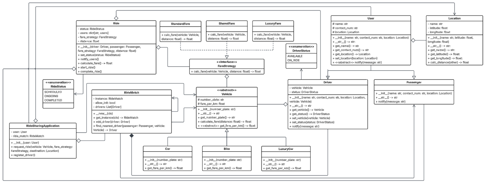

# UML Diagram:

# Patterns Used:
- **Singleton Pattern:** Used in the RideMatch Class since we need only one instance of that class to store all drivers and find the nearest driver.
- **Observer Pattern:** This pattern is used to notify all required users (driver and passenger) about the ride details and status.
- **Strategy Pattern:** Used to calculate fare for different fare types (standard, shared, luxury).
- **Facade:** Used in RideSharingApplication class. This is a common API given to users (drivers and passengers) for their ride booking for passengers and drivers to register themselves.